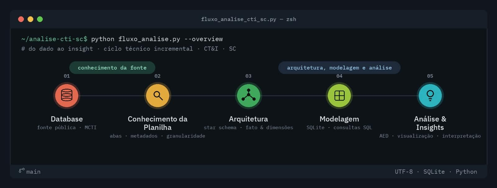
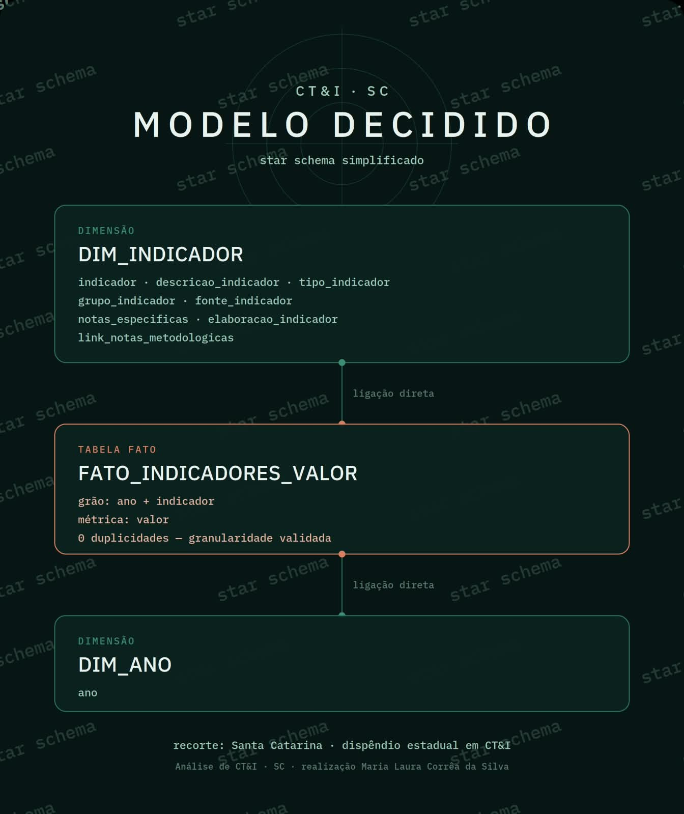

# Análise do Dispêndio em Ciência, Tecnologia e Inovação em Santa Catarina

## Análise exploratória de dados públicos



> Projeto avaliativo do Módulo 1 — Visualização de Dados e Business Intelligence.

Este repositório apresenta uma análise exploratória de dados públicos sobre o dispêndio estadual em Ciência, Tecnologia e Inovação (CT&I) em Santa Catarina.

O objetivo é investigar como esse dispêndio evoluiu ao longo do tempo, a partir de dados públicos do Ministério da Ciência, Tecnologia e Inovação (MCTI).

---

## 1. Pergunta de investigação

**Como evoluiu o dispêndio estadual em Ciência, Tecnologia e Inovação em Santa Catarina ao longo do tempo?**

**Recorte analítico:**

- **UF:** Santa Catarina — SC
- **Tema:** dispêndio estadual em Ciência, Tecnologia e Inovação
- **Dimensão temporal:** ano

---

## 2. Fonte dos dados

**Instituição:** Ministério da Ciência, Tecnologia e Inovação — MCTI

**Base:** Indicadores Nacionais de Ciência, Tecnologia e Inovação

**Arquivo:** `INDICADORES_CeT_PUB_2025.xlsx`

A base é pública e reúne indicadores e seus respectivos valores históricos.

---

## 3. Conhecimento da fonte

Antes da análise, a estrutura da base foi investigada para compreender:

- indicadores e metadados;
- valores históricos;
- relacionamentos entre as estruturas;
- granularidade dos registros;
- recortes geográfico e temporal.

Foram identificadas, entre outras, as estruturas:

- `INDICADORES`
- `INDICADORES_VALOR`

A relação entre indicador e valor histórico orientou a construção do modelo analítico.

---

## 4. Granularidade

A unidade principal da análise é:

> **um indicador em determinado ano.**

A métrica analisada é o **valor do indicador**.

A combinação `ANO + INDICADOR` foi utilizada para verificar a granularidade e possíveis duplicidades.

---

## 5. Modelagem

A partir da estrutura identificada na fonte, foi definido um **Star Schema simplificado**, adequado à pergunta de investigação.



### Modelo adotado

- `DIM_INDICADOR`
- `FATO_INDICADORES_VALOR`
- `DIM_ANO`

### Tabela fato

**FATO_INDICADORES_VALOR**

- **Grão:** um indicador em determinado ano
- **Métrica:** valor
- **Chave lógica:** `ANO + INDICADOR`

### Dimensão indicador

**DIM_INDICADOR**

Contém os atributos necessários para contextualizar e interpretar os indicadores.

### Dimensão temporal

**DIM_ANO**

Organiza a dimensão temporal para análise da evolução dos indicadores.

---

## 6. Metodologia

O fluxo da análise segue:

**Fonte → conhecimento da base → arquitetura → modelagem → SQL → análise exploratória → tratamento → visualização → insights**

Princípio orientador:

**pergunta → dado → estrutura → consulta → análise → evidência → interpretação**

---

## 7. SQL

As consultas SQL são utilizadas para:

- relacionar as estruturas do modelo;
- aplicar o recorte analítico;
- organizar a série temporal;
- realizar agregações;
- investigar variações;
- produzir evidências relacionadas à pergunta de investigação.

---

## 8. Análise exploratória

A análise exploratória considera:

- quantidade de registros;
- quantidade de indicadores;
- período disponível;
- valores ausentes;
- estatísticas descritivas;
- distribuição dos valores;
- comportamento temporal;
- variações relevantes;
- possíveis valores atípicos.

---

## 9. Tratamento

O tratamento dos dados é realizado a partir dos resultados da análise exploratória.

As transformações são documentadas para preservar a rastreabilidade:

**fonte original → dado tratado → análise → evidência**

A fonte original não é alterada.

---

## 10. Visualização e Insights

As visualizações são orientadas pela pergunta de investigação.

O objetivo é identificar padrões, variações e comportamentos relevantes nos dados e transformá-los em evidências interpretáveis.

Os insights serão construídos a partir dos resultados obtidos na análise.

---

## 11. Tecnologias

- Python
- Pandas
- SQL
- SQLite
- Excel / LibreOffice Calc
- Beekeeper Studio
- Seaborn
- Git / GitHub

---

## Estrutura do projeto

```text
05_analise_dispendio_inovacao_SC/
├── data/
├── docs/
├── imagens/
│   ├── fluxo_analise.jpeg
│   └── Modelo_schema_trabalho.jpeg
├── .gitignore
├── mapa_operacional_enquadramento_avaliacao.md
└── README.md

## Status

**Em desenvolvimento.**

Projeto avaliativo do Módulo 1 — Visualização de Dados e Business Intelligence.