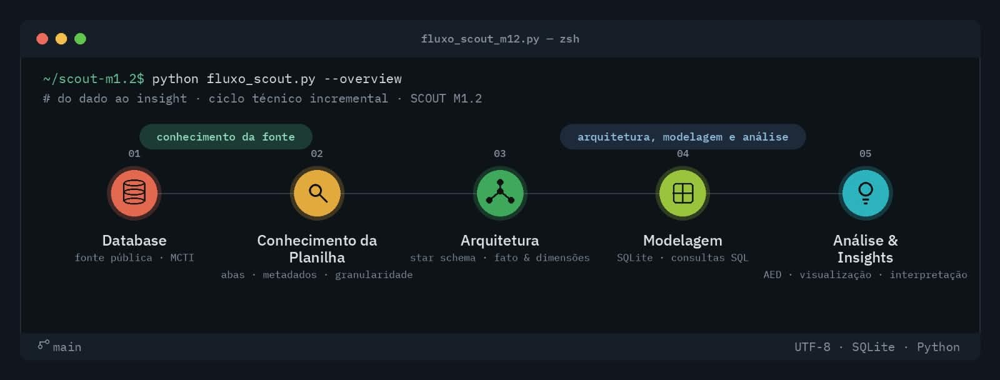
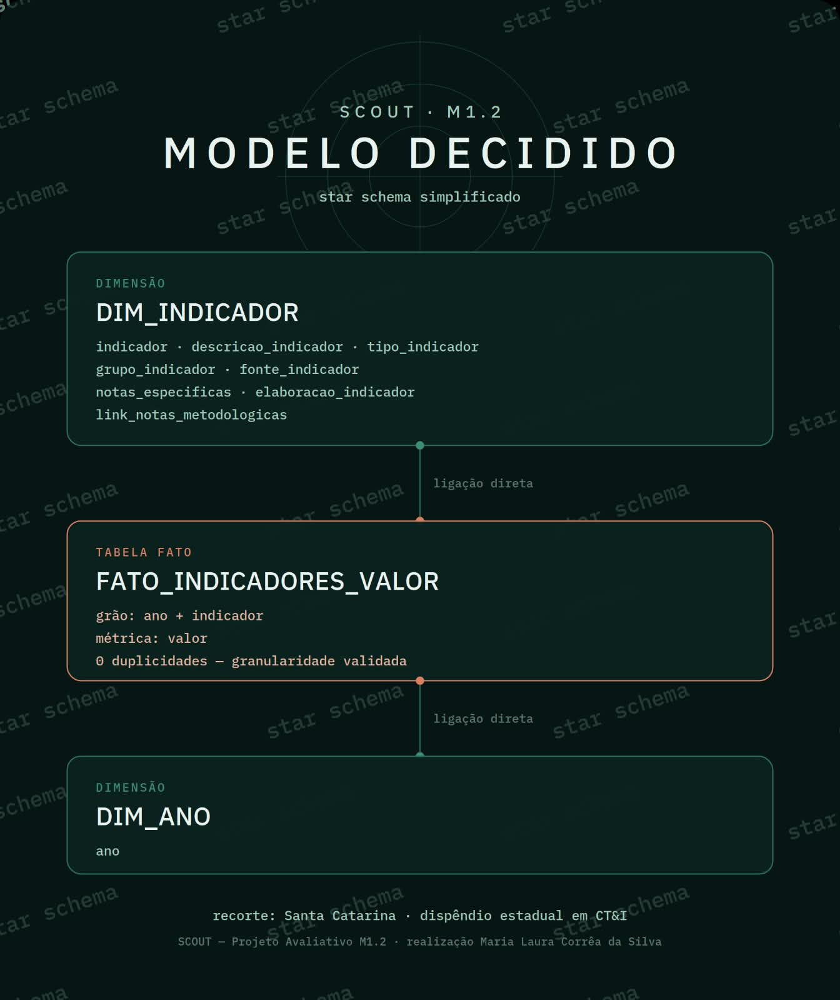

# SCOUT | M1.2

## Análise exploratória de dados públicos sobre Ciência, Tecnologia e Inovação



> Projeto avaliativo do Módulo 1 — Visualização de Dados e Business Intelligence.

O **SCOUT** é um laboratório de investigação orientada por dados sobre Ciência, Tecnologia e Inovação.

O **M1.2** aplica os conhecimentos do Módulo 1 sobre uma base pública do Ministério da Ciência, Tecnologia e Inovação (MCTI).

**Status:** em desenvolvimento

---

## 1. Pergunta de investigação

### Como evoluiu o dispêndio estadual em Ciência, Tecnologia e Inovação em Santa Catarina ao longo do tempo?

O recorte considera:

- **UF:** Santa Catarina — SC
- **Tema:** dispêndio estadual em Ciência, Tecnologia e Inovação
- **Dimensão temporal:** ano

---

## 2. Fonte dos dados

**Instituição:** Ministério da Ciência, Tecnologia e Inovação — MCTI

**Base:** Indicadores Nacionais de Ciência, Tecnologia e Inovação

**Arquivo:** `INDICADORES_CeT_PUB_2025.xlsx`

Abas identificadas:

- `METODOLOGIA`
- `INDICADORES`
- `TABELAS`
- `INDICADORES_VALOR`
- `TABELA_UF`
- `TABELA_UNIVERSIDADE`
- `ESTUDO`

---

## 3. Conhecimento da fonte

Para o recorte definido, foram identificadas duas estruturas principais:

### `INDICADORES`

Contém os metadados dos indicadores:

- `INDICADOR`
- `DESCRICAO_INDICADOR`
- `TIPO_INDICADOR`
- `GRUPO_INDICADOR`
- `FONTE_INDICADOR`
- `NOTAS_ESPECIFICAS`
- `ELABORACAO_INDICADOR`
- `LINK_NOTAS_METODOLOGICAS`

### `INDICADORES_VALOR`

Contém os valores históricos:

- `ANO`
- `INDICADOR`
- `VALOR`

Relação identificada:

`INDICADORES.INDICADOR → INDICADORES_VALOR.INDICADOR`

---

## 4. Granularidade

A combinação `ANO + INDICADOR` foi utilizada para verificar duplicidades.

**Resultado: 0 duplicidades.**

**Grão:** um indicador em determinado ano.

**Métrica:** `VALOR`

---

## 5. Particularidade da base

Os códigos dos indicadores podem incorporar informações sobre o recorte geográfico.

Exemplos:

- `DISP_EST_CT_REG_N`
- `DISP_EST_CT_REG_NE`
- `DISP_EST_CT_REG_SE`
- `DISP_EST_CT_REG_S`
- `DISP_EST_CT_REG_CO`

Também existem indicadores específicos por Unidade da Federação.

Essa característica foi considerada na definição e interpretação do recorte analítico.

---

# 6. Modelagem

A partir da estrutura identificada na fonte, foi definido um **Star Schema simplificado**, adequado à pergunta de investigação.



### Modelo adotado

- `DIM_INDICADOR`
- `FATO_INDICADORES_VALOR`
- `DIM_ANO`

### Tabela fato

`FATO_INDICADORES_VALOR`

**Grão:** um indicador em determinado ano.

**Métrica:** `VALOR`

**Chave lógica:** `ANO + INDICADOR`

### Dimensão indicador

`DIM_INDICADOR`

Fornece o contexto necessário para interpretar os indicadores e seus valores.

### Dimensão temporal

`DIM_ANO`

Permite organizar a análise da evolução dos indicadores ao longo dos anos.

---

## 7. Metodologia

O projeto seguirá as etapas:

**Fonte → Conhecimento da planilha → Arquitetura → Modelagem → SQL → AED → Tratamento → Visualização → Insights**

A análise será orientada pelo princípio:

**pergunta → dado → estrutura → consulta → análise → evidência → interpretação**

---

## 8. SQL

As consultas SQL serão utilizadas para:

- relacionar as estruturas do modelo;
- filtrar o recorte analítico;
- organizar a série temporal;
- realizar agregações;
- investigar variações;
- produzir evidências relacionadas à pergunta.

---

## 9. AED — Análise Exploratória de Dados

A análise exploratória irá investigar:

- quantidade de registros;
- quantidade de indicadores;
- período disponível;
- valores ausentes;
- estatísticas descritivas;
- distribuição dos valores;
- comportamento temporal;
- variações relevantes;
- possíveis valores atípicos.

---

## 10. Tratamento

O tratamento será realizado a partir dos resultados da análise exploratória.

As transformações serão documentadas para preservar a rastreabilidade:

**fonte original → dado tratado → análise → evidência**

A fonte original não será alterada.

---

## 11. Visualização e Insights

As visualizações serão orientadas pela pergunta de investigação.

O objetivo é identificar padrões, variações e comportamentos relevantes nos dados e transformá-los em evidências interpretáveis.

---

## 12. Tecnologias

- Excel / LibreOffice Calc
- SQLite
- Beekeeper Studio
- SQL
- Python
- Pandas
- Seaborn
- Git / GitHub

---

## Estrutura do projeto

```text
05_SCOUT/
│
├── data/
├── docs/
├── imagens/
├── notebooks/
├── scripts/
├── sql/
│
└── README.md